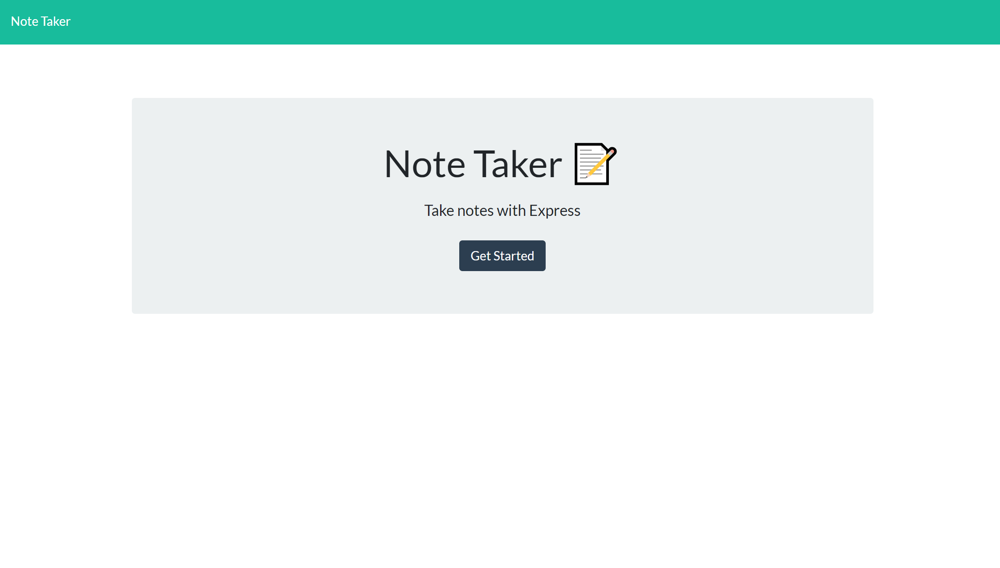
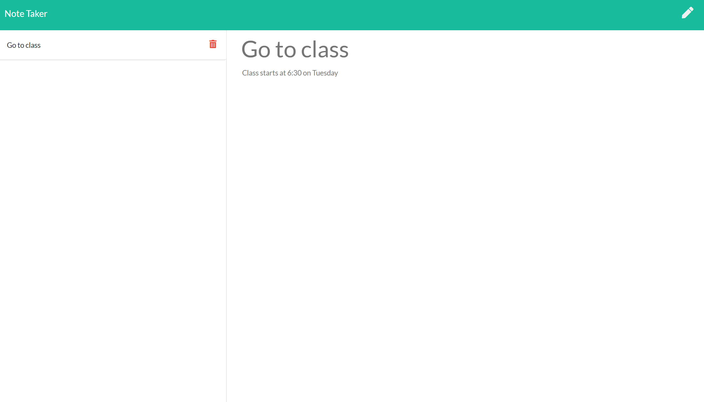

# Express-Note-Taker

**Description**

This application uses node.js and express to write a note and delete a note.  The webpage is available at 
port: localhost:1000.   Once on the homepage, the user is prompted to "Get Started".  When the button is 
clicked, it will bring them to the notes page where they can start writing notes.  There are buttons to 
save, write a note, and delete a note.

**Deployment**

-Clone repo to your computer.

-Open with VS code and open the terminal.

-Run 'npm install'.

-Run 'node server.js'.

-Open browser to 'http://localhost:1000'

**Built With**

-HTML

-CSS

-Javascript/jQuery

-Fontawesome

-Node.js

**Packages Used**

-Express

-fs

-path

**Images of Deployed Webpage**

                      

